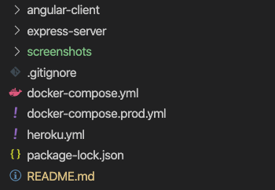
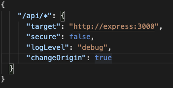

# MWA eCommerce Project
###### Contributors:

- Murad Hajiyev 
- Nurlan Kustutinov 
- Joe Sleiman 
- Amin Abdullozoda 

### Project Folder Structure

### Installation

The easiest way to configure development environment and run the application is to use Docker. [Docker](https://docs.docker.com/get-started/) is a set of platform as a service products that uses OS-level virtualization to deliver software in packages called containers. 

##### Docker configuration

After installing docker desktop in your machine, you just need to clone the project and go to the project folder from terminal or command prompt. 

Run the command `docker-compose up`. All containers will be run automatically. You can access angular from `localhost:4200` and express from `localhost:3000` and mongo from `localhost:27017`.

There is also an extra container mongo-seeder that helps to load seed data before run application.

Make sure that inside the angular proxy file, **express**(this is docker container) is written instead of localhost.

To solve CORS problem, angular's default `reverse-proxy` feature is used.

And make sure that inside express-server/config.json file, connection string is same like below:

`"connectionString": "mongodb://mongodb/ecommerce"`

Containers:

1. Express
2. Angular
3. Mongodb
4. Mongoseeder

### Manual Installation

###### Seeds

There are seed data inside `express-server/seeds` folder. You can take all Json files and import to local mongo database manually.

###### Express

And make sure that inside express-server/config.json file, connection string is same like below:

`"connectionString": "mongodb://localhost/ecommerce"`

###### Angular

Make sure you run application using `npm start` command, not `ng serve`

